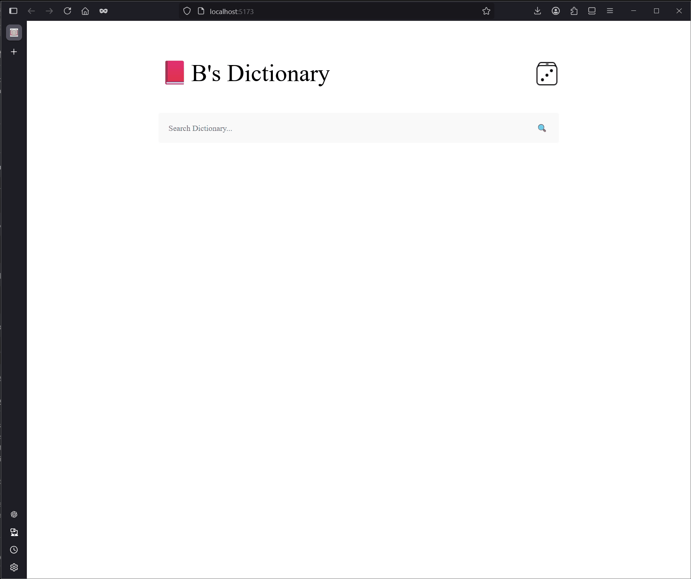

# 📕 Bryan's Dictionary

A minimalist yet powerful web app designed to help users learn new words. It fetches and displays a word's part of speech, pronunciation, audio pronunciation, definition, and a related image to enhance learning. Simply click the dice button to discover a random word to explore.

Built with HTML, CSS, and JavaScript.



---

## 🔧 How to Run Locally (With Vite)

1. **Clone the repository**

   ```bash
   git clone https://github.com/blopez024/BryanL_javascript-final-project.git
   cd BryanL_javascript-final-project
   ```

2. **Install dependencies**

   ```bash
   npm install
   ```

3. **Start the development server**

   ```bash
   npm run dev
   ```

4. **Open in your browser**
   After running the dev server, Vite will output a local URL such as:

   ```arduino
   http://localhost:5173/
   ```

Open that link in your browser to view the app!

## 🚀 Features

- ✅ Type a word in the search bar and press Enter or click the search button

- ✅ Learn how to pronounce the word through its phonetic spelling and audio playback

- ✅ Discover the word’s part of speech and definition

- ✅ View a related image to better visualize and connect with the word

---

## 🛠️ Technologies Used

- **HTML5**
- **CSS3**
- **JavaScript**
- **Vite**
- **NPM**
- **Git**

## 🙌 Credits

🧾 [Webster Dictionary API](https://dictionaryapi.com/products/api-collegiate-dictionary)

🖼️ [Pixaby API](https://pixabay.com/)
